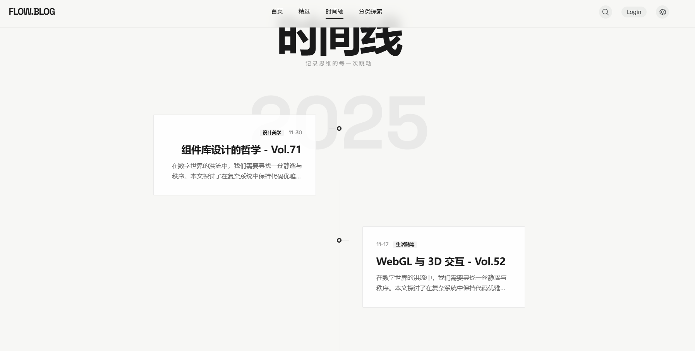
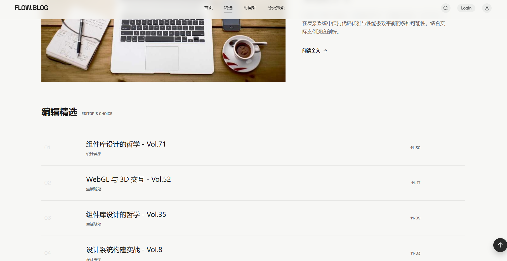
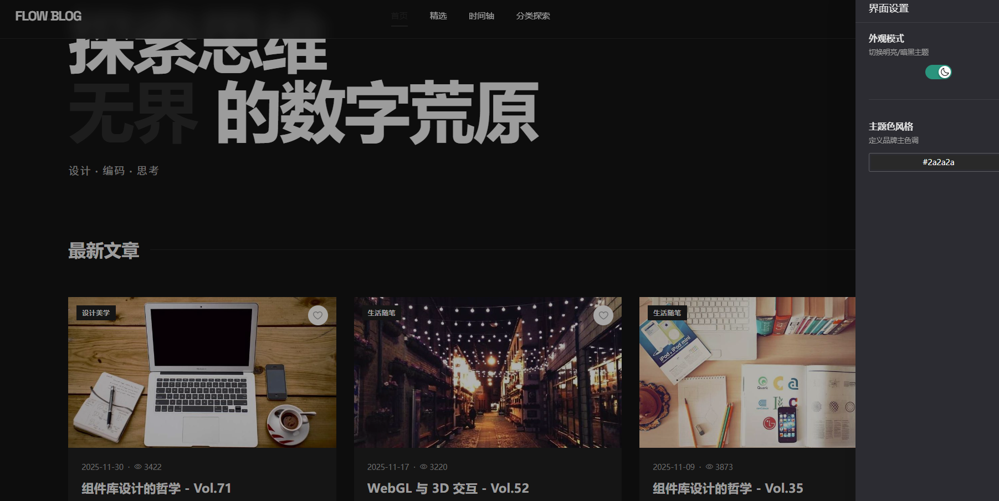

# FLOW BLOG 现代化设计的博客系统

## 说明

1. 基于vue3+vite+TypeScript+Pinia实现的博客展示页面，
2. 带有两个管理页面，使用管理员登录，可以使用后台文章管理，与用户管理
3. 遵循组件单一职能原则，封装了能复用的组件
4. pinia实现项目的模块化状态管理
5. 使用axios进行网络请求，实现前后端交互
6. UI使用awards风格的页面设计，具有现代化的布局页面，使用css变量配合sass混入与高级动画实现高质量的交互动画
7. 使用gsap生成页面入场动画
8. 开箱即用，项目自带mock随机数据

## 目前暂无预览站点，后端还在开发中，本质是为了学习后端项目开发而设计的项目

## 若要预览，请拉取项目后根据下方指示本地运行项目

拉取项目请先fork，dev为开发分支，master为生产分支

根目录 .env.development 配置开发环境变量，.env.production 配置生产环境变量

安装依赖：npm install

运行项目：npm run dev

登录管理员：admin password

如果你喜欢，请给我一个star.
